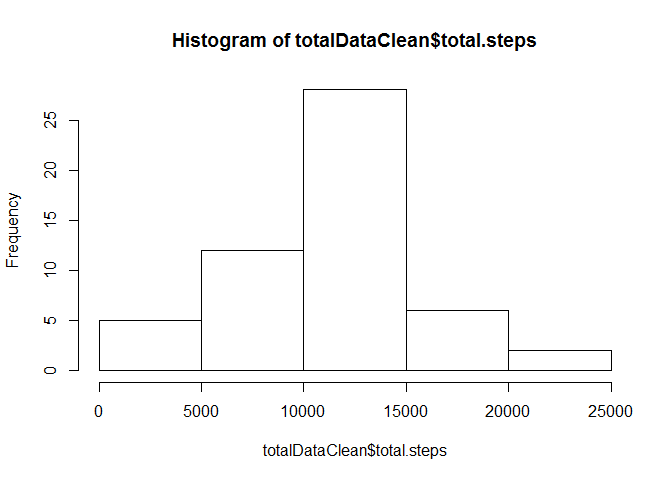
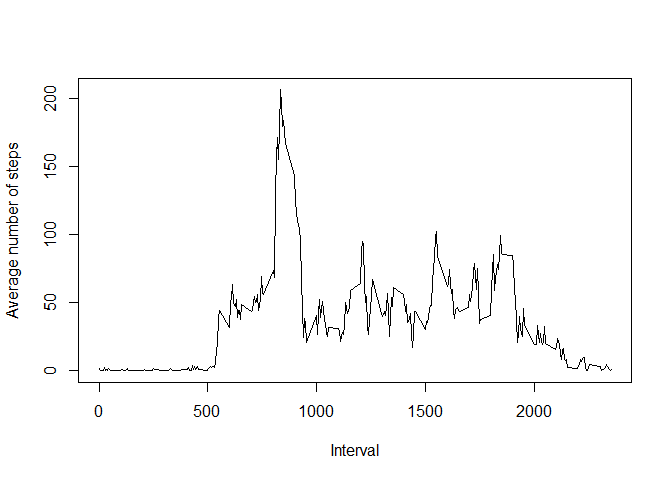

# Reproducible Research: Peer Assessment 1


## Loading and preprocessing the data

```r
unzip("activity.zip", overwrite = TRUE, exdir = "./data")
activityData <- read.csv("./data/activity.csv")
```

## What is mean total number of steps taken per day?

```r
activityDataClean <- activityData[complete.cases(activityData[,1:2]), ]
stepsDataClean <- aggregate(activityDataClean$steps, by=list(DateSteps=activityDataClean$date), FUN = sum)
x <- barplot(stepsDataClean$x, xlab = "", ylab="Total Steps")
text(x=x-.25,  y=-200, labels=stepsDataClean$DateSteps, cex=0.5, adj= 1, xpd=TRUE, srt=60)
```

 

```r
meanSteps <- mean(stepsDataClean$x)
medianSteps <- median(stepsDataClean$x)
```
Mean total number of steps taken per day = 10766  
Median total number of steps taken per day = 10765  

## What is the average daily activity pattern?

```r
averageDataClean <- aggregate(activityDataClean$steps, by=list(intervalMean=activityDataClean$interval), FUN = mean)
plot(averageDataClean$intervalMean, averageDataClean$x, type="l", xlab = "Interval", ylab="Average number of steps")
```

 

```r
intervalMaxMean <- averageDataClean[averageDataClean$x==max(averageDataClean$x), "intervalMean"]
```
On average across all the days in the dataset, the 5-minute interval that contains the maximum number of steps is 835.

## Imputing missing values


## Are there differences in activity patterns between weekdays and weekends?
